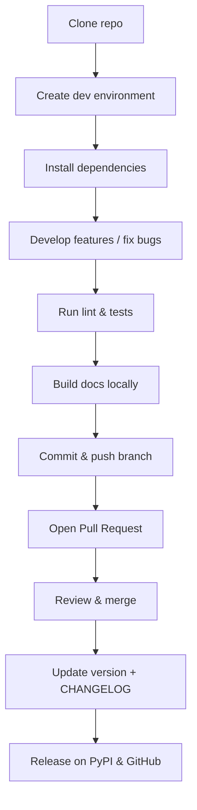

Here’s a cleaned-up, developer-focused version of your text reformatted as `README.dev.md`. I’ve removed redundant instructions, streamlined phrasing, and organized sections so that contributors can quickly find what they need:

---

# Developer Guide – `paidiverpy`

This document contains guidelines and instructions for contributors and maintainers of **`paidiverpy`**.
For user-facing documentation, see [README.md](README.md).

---

## Project Setup

This repository follows the [Netherlands eScience Center software guide](https://guide.esciencecenter.nl).
For a quick checklist of best practices, see [the software guide checklist](https://guide.esciencecenter.nl/#/best_practices/checklist).

---

## Supported Python Versions

* 3.10
* 3.11
* 3.12

See the [Python guide](https://guide.esciencecenter.nl/#/best_practices/language_guides/python) for details on supported versions.

---

## Installation for Development

### 1. Clone the repository

```bash
# SSH
git clone git@github.com:paidiver/paidiverpy.git

# HTTPS
# git clone https://github.com/paidiver/paidiverpy.git

cd paidiverpy
```

### 2. Create environment and install package

#### Option A: Conda (recommended)

```bash
conda init
exec bash  # restart terminal if needed

conda env create -f environment.yml
conda activate Paidiverpy

# install paidiverpy as editable package
pip install --no-cache-dir --editable .
# install dev dependencies
pip install --no-cache-dir --editable .[dev]
# install docs dependencies only
pip install --no-cache-dir --editable .[docs]
```

#### Option B: venv

```bash
python -m venv env
source env/bin/activate

python -m pip install --upgrade pip setuptools

# install paidiverpy as editable package
python -m pip install --no-cache-dir --editable .
# install dev dependencies
python -m pip install --no-cache-dir --editable .[dev]
# install docs dependencies only
python -m pip install --no-cache-dir --editable .[docs]
```

---

## Testing

Run tests with:

```bash
pytest -v
```

### Coverage

```bash
coverage run
coverage report
```

HTML and other output formats are available. See `coverage help`.

---

## Linting & Code Style

This project uses [ruff](https://beta.ruff.rs/docs/) for linting and [yapf](https://github.com/google/yapf) for formatting.

```bash
# lint check
ruff check .

# lint with auto-fix
ruff check . --fix
```

Enable git pre-commit hook for automatic linting:

```bash
git config --local core.hooksPath .githooks
```

---

## Documentation

* Documentation lives in [`docs/`](docs/).
* Generated with **Sphinx** and the **ReadTheDocs theme**.
* API docs are generated with [AutoAPI](https://sphinx-autoapi.readthedocs.io/).

Build locally:

```bash
cd docs
make html
```

Or, without `make`:

```bash
sphinx-build -b html docs docs/_build/html
```

Check for undocumented objects:

```bash
cd docs
make coverage
cat _build/coverage/python.txt
```

---

## Versioning

We use [semantic versioning](https://guide.esciencecenter.nl/#/best_practices/releases?id=semantic-versioning).
Version is managed in `pyproject.toml` with [bump-my-version](https://github.com/callowayproject/bump-my-version).

Examples:

```bash
bump-my-version bump major  # 0.3.2 → 1.0.0
bump-my-version bump minor  # 0.3.2 → 0.4.0
bump-my-version bump patch  # 0.3.2 → 0.3.3
```

---

## Release Process

Releases consist of three parts:

### 1. Preparation

* Update [CHANGELOG.md](CHANGELOG.md).
* Verify [`CITATION.cff`](CITATION.cff).
* Bump version.
* Run tests:

  ```bash
  pytest -v
  ```

### 2. Publish to PyPI

```bash
python -m pip install --upgrade pip
python -m pip install .[publishing]

python -m build
python -m twine upload --repository testpypi dist/*
```

Verify on [Test PyPI](https://test.pypi.org/project/paidiverpy).
Then install from Test PyPI in a clean environment to confirm.

If successful, upload to PyPI:

```bash
python -m twine upload dist/*
```

### 3. GitHub Release

Create a [new release](https://github.com/paidiver/paidiverpy/releases/new) on GitHub.
This also triggers Zenodo to mint a DOI snapshot.

---

## Additional Development Notes

* **Logging**: use the `logging` module (not `print`).
* **CI**: tests run via GitHub Actions across all supported Python versions.
* **Code quality**: [SonarCloud](https://sonarcloud.io/) is integrated (`sonar-project.properties` + `.github/workflows/sonarcloud.yml`).
* **Packaging**: non-Python files should be listed in [`MANIFEST.in`](MANIFEST.in).
* **Policies**: see [CODE\_OF\_CONDUCT.md](CODE_OF_CONDUCT.md) and [CONTRIBUTING.md](CONTRIBUTING.md).
* **Licensing**: attributions are maintained in [`NOTICE`](NOTICE).

---

✅ With this guide, you should be able to:

* Set up a dev environment
* Run tests and linting
* Build docs
* Manage versions
* Publish releases to PyPI & GitHub

---

Would you like me to also **add a short contributor workflow diagram** (e.g., clone → dev env → code → lint/test → docs → PR → release) so new developers can get the big picture at a glance?


Perfect 👍 I’ll add a simple workflow diagram in Markdown so it renders directly in GitHub. Here’s the updated `README.dev.md` with the contributor workflow at the end:

---

# Developer Guide – `paidiverpy`

This document contains guidelines and instructions for contributors and maintainers of **`paidiverpy`**.
For user-facing documentation, see [README.md](README.md).

---

## Project Setup

This repository follows the [Netherlands eScience Center software guide](https://guide.esciencecenter.nl).
For a quick checklist of best practices, see [the software guide checklist](https://guide.esciencecenter.nl/#/best_practices/checklist).

---

## Supported Python Versions

* 3.10
* 3.11
* 3.12

See the [Python guide](https://guide.esciencecenter.nl/#/best_practices/language_guides/python) for details on supported versions.

---

## Installation for Development

### 1. Clone the repository

```bash
# SSH
git clone git@github.com:paidiver/paidiverpy.git

# HTTPS
# git clone https://github.com/paidiver/paidiverpy.git

cd paidiverpy
```

### 2. Create environment and install package

#### Option A: Conda (recommended)

```bash
conda init
exec bash  # restart terminal if needed

conda env create -f environment.yml
conda activate Paidiverpy

# install paidiverpy as editable package
pip install --no-cache-dir --editable .
# install dev dependencies
pip install --no-cache-dir --editable .[dev]
# install docs dependencies only
pip install --no-cache-dir --editable .[docs]
```

#### Option B: venv

```bash
python -m venv env
source env/bin/activate

python -m pip install --upgrade pip setuptools

# install paidiverpy as editable package
python -m pip install --no-cache-dir --editable .
# install dev dependencies
python -m pip install --no-cache-dir --editable .[dev]
# install docs dependencies only
python -m pip install --no-cache-dir --editable .[docs]
```

---

## Testing

Run tests with:

```bash
pytest -v
```

### Coverage

```bash
coverage run
coverage report
```

HTML and other output formats are available. See `coverage help`.

---

## Linting & Code Style

This project uses [ruff](https://beta.ruff.rs/docs/) for linting and [yapf](https://github.com/google/yapf) for formatting.

```bash
# lint check
ruff check .

# lint with auto-fix
ruff check . --fix
```

Enable git pre-commit hook for automatic linting:

```bash
git config --local core.hooksPath .githooks
```

---

## Documentation

* Documentation lives in [`docs/`](docs/).
* Generated with **Sphinx** and the **ReadTheDocs theme**.
* API docs are generated with [AutoAPI](https://sphinx-autoapi.readthedocs.io/).

Build locally:

```bash
cd docs
make html
```

Or, without `make`:

```bash
sphinx-build -b html docs docs/_build/html
```

Check for undocumented objects:

```bash
cd docs
make coverage
cat _build/coverage/python.txt
```

---

## Versioning

We use [semantic versioning](https://guide.esciencecenter.nl/#/best_practices/releases?id=semantic-versioning).
Version is managed in `pyproject.toml` with [bump-my-version](https://github.com/callowayproject/bump-my-version).

Examples:

```bash
bump-my-version bump major  # 0.3.2 → 1.0.0
bump-my-version bump minor  # 0.3.2 → 0.4.0
bump-my-version bump patch  # 0.3.2 → 0.3.3
```

---

## Release Process

Releases consist of three parts:

### 1. Preparation

* Update [CHANGELOG.md](CHANGELOG.md).
* Verify [`CITATION.cff`](CITATION.cff).
* Bump version.
* Run tests:

  ```bash
  pytest -v
  ```

### 2. Publish to PyPI

```bash
python -m pip install --upgrade pip
python -m pip install .[publishing]

python -m build
python -m twine upload --repository testpypi dist/*
```

Verify on [Test PyPI](https://test.pypi.org/project/paidiverpy).
Then install from Test PyPI in a clean environment to confirm.

If successful, upload to PyPI:

```bash
python -m twine upload dist/*
```

### 3. GitHub Release

Create a [new release](https://github.com/paidiver/paidiverpy/releases/new) on GitHub.
This also triggers Zenodo to mint a DOI snapshot.

---

## Additional Development Notes

* **Logging**: use the `logging` module (not `print`).
* **CI**: tests run via GitHub Actions across all supported Python versions.
* **Code quality**: [SonarCloud](https://sonarcloud.io/) is integrated (`sonar-project.properties` + `.github/workflows/sonarcloud.yml`).
* **Packaging**: non-Python files should be listed in [`MANIFEST.in`](MANIFEST.in).
* **Policies**: see [CODE\_OF\_CONDUCT.md](CODE_OF_CONDUCT.md) and [CONTRIBUTING.md](CONTRIBUTING.md).
* **Licensing**: attributions are maintained in [`NOTICE`](NOTICE).

---

## Contributor Workflow (at a glance)



---

✅ With this guide, you should be able to:

* Set up a dev environment
* Run tests and linting
* Build docs
* Manage versions
* Publish releases to PyPI & GitHub

---

Do you want me to also **add a “First-time contributor checklist”** (a short step-by-step list for new devs) at the top so onboarding is even quicker?
