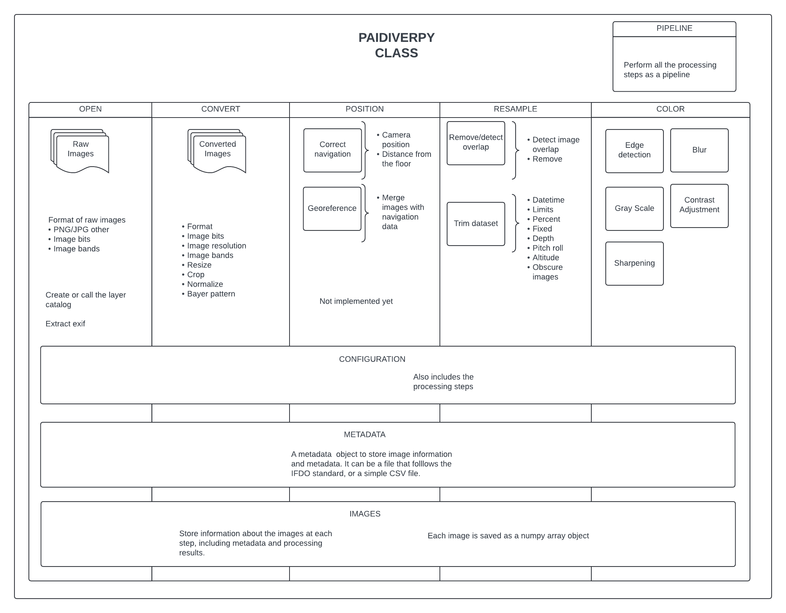

# Paidiverpy

Paidiverpy is a Python package designed to create pipelines for preprocessing image data for biodiversity analysis.

## Installation

You can install `pydiver` either locally or on a notebook server such as JASMIN or the NOC Data Science Platform (DSP). The following steps are applicable to both environments, but the second and third steps are required if you are using a notebook server.

1. Clone the repository:

    ```bash
    git clone git@github.com:paidiver/paidiverpy.git
    cd paidiverpy
    ```

2. (Optional) Create a Python virtual environment to manage dependencies separately from other projects. For example, using `mamba`:

    ```bash
    mamba init

    # Command to restart the terminal. This command may not be necessary if mamba init has already been successfully run before
    exec bash

    mamba env create -f environment.yml
    mamba activate Paidiverpy
    ```

3. (Optional) For JASMIN or DSP users, you also need to install the environment in the Jupyter IPython kernel. Execute the following command:

    ```bash
    python -m ipykernel install --user --name Paidiverpy
    ```

4. Install the paidiverpy package:

    Finally, you can install the paidiverpy package:

    ```bash
    pip install -e .
    ```

## Example Data

To access example data, run the following commands:

```bash
mkdir -p examples/data && cd examples/data

# jen images
wget https://paidiver-o.s3-ext.jc.rl.ac.uk/paidiverpy/data/jen_images.zip
unzip jen_images.zip && rm -f jen_images.zip

# mojtaba images
wget https://paidiver-o.s3-ext.jc.rl.ac.uk/paidiverpy/data/mojtaba_images.zip
unzip mojtaba_images.zip && rm -f mojtaba_images.zip

# loic images
wget https://paidiver-o.s3-ext.jc.rl.ac.uk/paidiverpy/data/loic_images.zip
unzip loic_images.zip && rm -f loic_images.zip
```

These commands will download and extract the sample data into the `examples/data` directory.

## Package Organization

### Configuration File

First, create a configuration file. Some example configuration files for processing the example datasets are provided in the `example/config` directory. You can use these configuration files to test the example notebooks described in the [Usage section](#usage). However, remember to change the path of `input_path`, `output_path`, and `catalog_path`.

### Catalog

To use this package, you may need a catalog file. The catalog file can be an IFDO.json file or a CSV file. If it is a CSV, it should contain a list of filenames of the files to be processed. The filename column should be named one of the following: `['filename', 'file_name', 'FileName', 'File Name']`.

Some functions may also require datetime, latitude, and longitude data. These columns should have the following names:
- Datetime columns: `['datetime', 'date_time', 'DateTime', 'Datetime']`
- Latitude columns: `['lat', 'latitude_deg', 'latitude', 'Latitude', 'Latitude_deg', 'Lat']`
- Longitude columns: `['lon', 'longitude_deg', 'longitude', 'Longitude', 'Longitude_deg', 'Lon']`

Two examples of CSV catalogs are available in the `example/catalog` directory. The IFDO catalog feature has not been tested yet due to the lack of a dataset with an IFDO catalog for testing.

### Layers

The package is organized into several layers as shown below:



The parent class, `Paidiverpy`, contains the main functions and information necessary for image processing. Below this class, there are several subclasses, each responsible for different types of image processing: `OpenLayer`, `ConvertLayer`, `PositionLayer`, `ResampleLayer`, and `ColorLayer`.

To transfer information between layers, the following classes are used:

- `Configuration`: Parses the configuration file and adds new configurations during processing.
- `Catalog`: Parses the catalog and stores image metadata.
- `ImagesLayer`: Stores the outputs of each image processing step. Each individual image inside the `ImagesLayer` is represented by an `ImageLayer` class, containing individual information about each image.

The `Pipeline` class is crucial for integrating the entire processing pipeline into one simple class and performing all the steps described in the configuration file.

## Usage

Comprehensive documentation is forthcoming. Meanwhile, sample notebooks demonstrating various use cases are available in the `examples/example_notebooks` directory:

- [Open and display a configuration file and a catalog file](examples/example_notebooks/config_catalog_example.ipynb)
- [Run processing steps without creating a pipeline](examples/example_notebooks/simple_processing.ipynb)
- [Run a pipeline described in a configuration file and interact with the outputs](examples/example_notebooks/pipeline.ipynb)
- [Run pipeline steps in test mode](examples/example_notebooks/pipeline_testing_steps.ipynb)

- [Create your own pipeline from a Python script](examples/example_notebooks/pipeline_generation.ipynb)
- [Rerun pipeline steps, modify configurations, and plot test data before applying changes](examples/example_notebooks/pipeline_interaction.ipynb)


### Command-Line Arguments

You can execute the pipelines using command-line arguments. Here’s an example:

```
paidiverpy -c examples/config_files/config_1.yaml
```

This command will run the pipeline as specified in the configuration file and save the output images to the directory defined in the configuration file’s `output_path` setting.